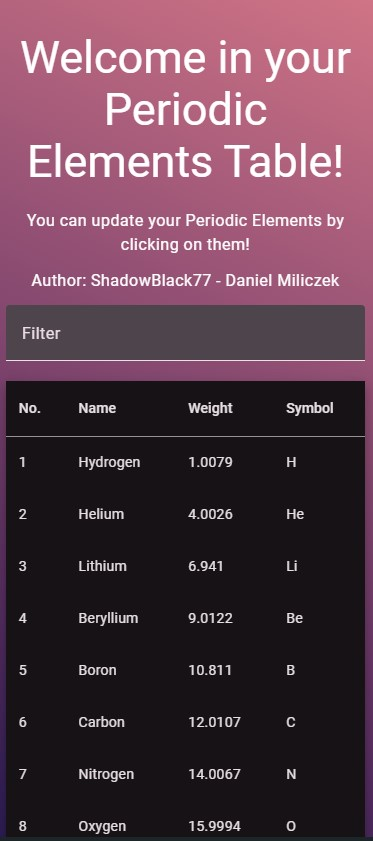

  

    <h1 align="center">Periodic Elements Table</h1>
  

  

    

      

        Live Preview: <a href="https://shadowblack77-periodic-elements-table.netlify.app/" target="_blank">Click Me!</a>
      

    

    

      

        <h3>Technologies used</h3>
      

      

        <ul>
          <li>Angular v18</li>
          <li>Angular Materials</li>
          <li>GSAP</li>
          <li>SCSS</li>
        </ul>
      

    

    

      

        A project that displays data using an Angular Material table with filtering functionality at the user's discretion. The application also allows data modification through a simple panel with validation. Additionally, the GSAP library was used to create animations. It is worth noting that the application is fully responsive and adapts to different screen sizes.
      

    

    

      

        <h3>Gallery Image</h3>
      

      

        

          
Desktop Preview

          
        

      

            

        

          
Desktop Preview <i>With settings</i>

          
        

      

      

        

          
Laptop Preview

          
        

      

      

        

          
Phone Preview

          
        

      

    

  

